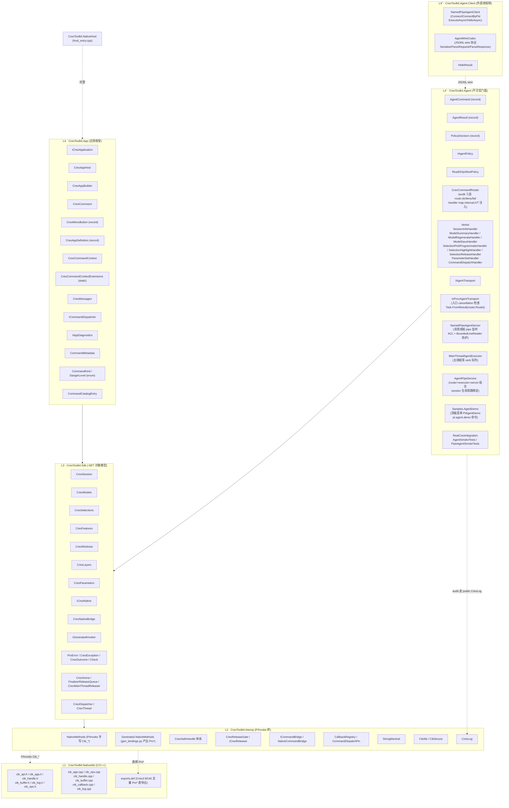
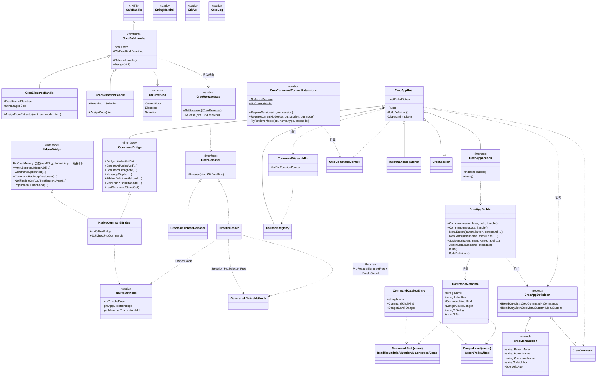
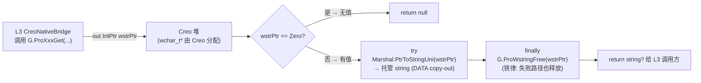

# CreoToolkit Refactor · 当前代码类图

> 本文档记录对象模型类图。

按维度分五张图,从分层 → 对象模型 → 句柄 → 命令路径 → 直绑流向。

进程内加载链（Creo → NativeHost → CLR 4 → Host → App）见
[host-loading.md](./host-loading.md) / [host-loading.drawio](./host-loading.drawio)。

---

## 一、分层全景(L1 → L4)

---

## 二、L3 对象模型继承(Model 层级 + ModelItem 层级)

```mermaid
classDiagram
    %% ===== CreoModel 层级 =====
    class ICreoModel { <<interface>>
        +CreoModelType Type
    }
    class CreoModel {
        +string Name
        +CreoModelType Type
        +string Extension
        +string FullName
        +CreoParameters Parameters
        +CreoLayers Layers
        +CreoModelItems Items
        +Save()
        +Erase()
        +Delete()
        +Rename(newName, saveAfter) CreoModel
        +Backup(targetDirectory)
        +CopyTo(newName) CreoModel?
        +ListDependencies()
        +CleanupDependencies()
        +AsSolid() CreoSolid?
        +ToModelItem() ICreoModelItem?
        +IsModified() bool
        +IsSkeleton() bool?
        +IsModifiable() bool?
        +IsSaveAllowed() bool?
        +IsLocationStandard() bool?
        +GetLock() bool?
        +SetLock(locked)
        +GetOrigin() string?
        +GetCommonName() string?
        +GetMdlName() string?
        +GetDisplayName() string?
        +GetDirectoryPath() string?
        +GetWindowId() int?
        +GetData() ModelDataRecord?
        +GetUnit(unitName) CreoUnit?
        +GetUnitByExpression(expression) CreoUnit?
        +GetPrincipalUnitSystem() CreoUnitSystem?
        +ListUnitSystems()
        +CreateGtol(type, valueString, x, y, z)
        +ReadGtol(gtolId) GtolInfo
        +DeleteGtol(gtolId)
        +ListGeometricTolerances()
        +PrepareGtolAttachAndReadMakeDim(x, y, z) DimensionAttachments?
    }
    class CreoSolid {
        <<abstract>>
        +Regenerate()
        +Display()
        +GetOutline()
        +GetMassProperty()
        +GetRegenerationStatus() int?
        +ComputeOutline(method, coordSys) CreoBoundingBox?
        +GetAccuracy() SolidAccuracyRecord?
        +IsNoresolveMode() bool?
        +CheckFamilyTable() int?
        +IsFamilyInstance() bool?
        +ListFamilyInstanceNames() IReadOnlyList~string~
        +GetGenericName() string?
        +ListFailedFeatures()
        +ListFailedFeatureIds()
        +ListAxes()
        +ListCsys()
        +ListSurfaces()
        +ListQuilts()
        +ListDimensions(includeRefDimensions)
        +ListRelationSets()
        +GetCableSegmentBoundaries(cableId) IReadOnlyList~CableSegmentBoundary~?
        +EvaluateAngle(item1, item2) double?
        +EvaluateDistance(item1, item2) double?
        +EvaluateDiameter(item) double?
        +SetPrincipalUnitSystem(newSystem, conversionMode)
        +SetPrincipalUnitSystem(newSystem, conversionMode, ignoreParamUnits)
    }
    class CreoPart {
        <<sealed>>
        +ListMaterialNames()
        +GetCurrentMaterial()
        +GetDensity()
    }
    class CreoAssembly {
        <<sealed>>
        +ListTopLevelComponentFeatureIds()
        +ListComponents()
        +GetComponent(compIdPath) CreoComponentPath
        +GetSkeletonName() string?
        +GetSkeleton() CreoPart?
        +GetPathMdl(compIdPath) CreoModel?
        +GetPathTransform(compIdPath, localToTop) CreoMat4?
        +AssembleComponent(component, constraints) CreoFeature
        +CreateComponentByCopy(name, template, leaveUnplaced) CreoFeature
        +SetComponentPosition(compFeatId, position)
        +GetComponentConstraints(compFeatId)
        +GetSnapshotTransforms(snapshotName) IReadOnlyList~SnapshotTransform~?
        +CreateSnapshot(snapshotName)
        +DeleteSnapshot(snapshotName)
        +Explode()
        +Unexplode()
        +IsExploded() bool?
    }
    class CreoDrawing {
        <<sealed>>
        +GetSheetsCount() int?
        +GetCurrentSheetIndex() int?
        +GetViewsCount() int?
        +GetCurrentSolid() CreoSolid?
        +ListViewIds()
        +ListViews()
        +ListViewsWithSkip() CreoDrawingViewListResult
        +ListTables()
        +ListDrawingTableItems()
        +ListDimensions(dimType)
        +ListDetailNotes(sheet)
        +ListDetailNoteItems(sheet)
        +ListDetailGroups(sheet)
        +ListDtlentities(sheet)
        +ListDraftEntityItems(sheet)
        +ProbeDtlentities(maxId)
        +GetDtlentityData(entity) CreoDtlentityData?
        +CreateDraftEntity(curve, color) int?
        +CreateTable(spec) CreoDrawingTable
        +DeleteTable(tableId)
        +ReadTableCellText(tableId, col, row)
        +GetTableRowsCount(tableId)
        +GetTableColumnsCount(tableId)
        +CreateDimension(viewId, attachItems, senses, orientHint, location, asRefDimension) CreoModelItem?
        +DeleteDimension(dimension)
        +GetDimensionAttachments(dimension) DimensionAttachments?
        +ConvertToOrdinateBaseline(linearDim, nearAttachPoint) CreoModelItem?
        +ConvertToOrdinate(linearDim, baseline)
        +ConvertToLinear(ordinateDim)
        +GetOrdinateInfo(dimension)
    }
    class CreoLayout { <<sealed>> }
    class CreoFormat { <<sealed>> }
    class CreoDiagram { <<sealed>> }
    class CreoMarkup { <<sealed>> }
    class CreoNotebook { <<sealed>> }
    class CreoHarness { <<sealed>> }

    ICreoModel <|.. CreoModel
    CreoModel <|-- CreoSolid
    CreoSolid <|-- CreoPart
    CreoSolid <|-- CreoAssembly
    CreoModel <|-- CreoDrawing
    CreoModel <|-- CreoLayout
    CreoModel <|-- CreoFormat
    CreoModel <|-- CreoDiagram
    CreoModel <|-- CreoMarkup
    CreoModel <|-- CreoNotebook
    CreoModel <|-- CreoHarness

    %% ===== CreoModelItem 层级 =====
    class ICreoModelItem { <<interface>>
        +CreoModelItemType Type
        +int Id
        +GetName()
    }
    class CreoModelItem {
        非abstract 可降级实例化
        #ItemRef Ref
        +int Id
        +GetName()
        +SetName(name)
        +CanRename()
        +GetDefaultName()
        +ClearUserName()
        +string OwnerModelName
        +As~T~()
        +Equals() / GetHashCode()
        +ToString()
        +CreateFromRef(session,itemRef)$
    }
    class CreoFeature {
        <<sealed>>
        +Delete()
        +ExtractElementTree() CreoElementTree
        +ExtractElementTreeDeep() CreoRichElementTree
        +GetInfo() CreoFeatureInfo?
        +GetParentIds()
        +GetParents()
        +GetChildIds()
        +GetChildren()
        +ListGeomItems(itemType) IReadOnlyList~ICreoModelItem~
    }
    class CreoAxis { <<sealed>> }
    class CreoCsys {
        <<sealed>>
        +GetMatrix() CreoMat4?
        +GetCoordSystem() CreoCoordSystem?
    }
    class CreoPoint {
        <<sealed>>
        +GetCoord() CreoVec3?
    }
    class CreoCurve { <<sealed>> }
    class CreoEdge { <<sealed>> }
    class CreoSurface {
        <<sealed>>
        +GetSurfaceType() int?
        +GetPlane() CreoPlane?
    }
    class CreoQuilt { <<sealed>> }
    class CreoLayer { <<sealed>> }
    class CreoNote { <<sealed>> }
    class CreoDimension {
        <<sealed>>
        +GetValue() double?
        +GetTypeCode() int?
        +GetDisplayText() string?
        +GetAttachments() DimensionAttachments?
    }
    class CreoRefDimension {
        <<sealed>>
        +GetValue() double?
        +GetTypeCode() int?
        +GetDisplayText() string?
        +GetAttachments() DimensionAttachments?
    }

    ICreoModelItem <|.. CreoModelItem
    CreoModelItem <|-- CreoFeature
    CreoModelItem <|-- CreoAxis
    CreoModelItem <|-- CreoCsys
    CreoModelItem <|-- CreoPoint
    CreoModelItem <|-- CreoCurve
    CreoModelItem <|-- CreoEdge
    CreoModelItem <|-- CreoSurface
    CreoModelItem <|-- CreoQuilt
    CreoModelItem <|-- CreoLayer
    CreoModelItem <|-- CreoNote
    CreoModelItem <|-- CreoDimension
    CreoModelItem <|-- CreoRefDimension

    %% ===== Drawing 明细项层级 =====
    class CreoDetailItem {
        <<abstract>>
        #long Epoch
    }
    class CreoDraftEntity {
        <<sealed>>
        +ToToken() CreoDtlentity
    }
    class CreoDetailNote { <<sealed>> }
    class CreoDrawingTable { <<sealed>> }

    CreoModelItem <|-- CreoDetailItem
    CreoDetailItem <|-- CreoDraftEntity
    CreoDetailItem <|-- CreoDetailNote
    CreoDetailItem <|-- CreoDrawingTable

    %% ===== 写路径 DTO / enum =====
    class AssemblyConstraintSpec {
        <<struct>>
        +CreoAssemblyConstraintType Type
        +double Offset
        +CreoAssemblyConstraintSide AsmRefSide
    }
    class AssemblyConstraintInfo {
        <<struct>>
        +CreoAssemblyConstraintType Type
        +double Offset
        +CreoModelItemType? AsmRefType
        +CreoModelItemType? CompRefType
    }
    class CreoGtolType { <<enum>> Straightness / Flatness / ... }
    class GtolInfo {
        <<struct>>
        +CreoGtolType Type
        +string? ValueString
    }
    class DrawingTableSpec {
        +int Rows
        +int Columns
        +double[]? ColumnWidths
    }
    class HoleBuilder {
        +Diameter(d) HoleBuilder
        +Depth(d) HoleBuilder
        +PlacementPlane(plane) HoleBuilder
        +LinearReference(ref, dist) HoleBuilder
        +Build(model) CreoFeature
    }
    class CreoComponent {
        +int FeatureId
        +IReadOnlyList~int~ Path
        +CreoAssembly Root
        +CreoFeature Feature
    }
    class SnapshotTransform {
        <<record>>
        +int TableNum
        +IReadOnlyList~int~ ComponentIds
        +IReadOnlyList~double~ Matrix4x4
    }
    class CableSegmentBoundary {
        <<record>>
        +CableBoundaryItem Start
        +CableBoundaryItem End
    }
    class CableBoundaryItem {
        <<record>>
        +int TypeCode
        +int Id
    }
    class DimensionAttachments {
        <<record>>
        +ICreoModelItem? AnnotationPlane
        +int OrientHint
        +int AttachmentCount
        +IReadOnlyList~DimSense~ Senses
        +CreoVec3? Location
    }
    class DimSense {
        <<record>>
        +int Type
        +int Sense
        +int OrientHint
    }

    CreoAssembly ..> AssemblyConstraintSpec : 约束参数
    CreoAssembly ..> CreoComponent : ListComponents 产出
    CreoAssembly ..> SnapshotTransform : GetSnapshotTransforms 返回
    CreoSolid ..> CableSegmentBoundary : GetCableSegmentBoundaries 返回
    CableSegmentBoundary ..> CableBoundaryItem : Start/End
    CreoModel ..> GtolInfo : ReadGtol 返回
    CreoModel ..> DimensionAttachments : PrepareGtolAttachAndReadMakeDim 返回
    CreoDimension ..> DimensionAttachments : GetAttachments 返回
    CreoRefDimension ..> DimensionAttachments : GetAttachments 返回
    CreoDrawing ..> DimensionAttachments : GetDimensionAttachments 返回
    DimensionAttachments ..> DimSense : Senses
    CreoDrawing ..> DrawingTableSpec : CreateTable 参数
    CreoDrawing ..> CreoDrawingTable : CreateTable 返回
    HoleBuilder ..> CreoFeature : Build 产出
```

> **类名核对说明**：`CreoGtol` 和 `CreoMaterial` 在当前代码中**不存在**；GTol 通过 `ProMdlGtolVisit` 枚举后由工厂降级为基类 `CreoModelItem` 实例（type=32）。写路径经 `CreoModel.CreateGtol`/`ReadGtol`/`DeleteGtol` + `CreoGtolType` enum + `GtolInfo` struct 闭环。`IHideable` 接口暂不提供，待真业务触发再加。

---

## 三、L3 Session 聚合 + L2 桥

```mermaid
classDiagram
    class CreoSession {
        +CreoModels Models
        +CreoSelections Selections
        +CreoFeatures Features
        +CreoWindows Windows
        +CreoEvents Events
        +CreoEventBus EventBus
        +Attach()$
        +RunOnMainThread(Action)
        +GetConfigOption(option) string?
        +ListConfigOptionValues(option)
        +SetConfigOption(option, value)
        +Dispose()
    }

    class CreoModels {
        +GetCurrent()
        +Retrieve(name, type)
        +Load(fullPath)
        +Init(name, type)
        +EraseAll(type)
        +EraseNotDisplayed()
        +RetrieveSimprep(...)
        +CreateModel(session, id)$
    }
    class CreoSelections {
        +Select(options): CreoSelectionSet
        +Select(optionKeywords, maxNumSels=-1)
        +CreateModelItemSelection(item, path)
    }
    class CreoSelectFilters {
        <<static>>
        +DraftEntity string$
        +DetailSymbol string$
        +Note string$
        +DrawingTable string$
        +Dimension string$
        +RefDimension string$
        +Gtol string$
        +Join(tokens) string$
    }
    class CreoSelectionOptions {
        +OptionKeywords
        +MaxNumSels
    }
    class CreoSelectionSet {
        +Count
        +this[index]
        +Dispose()
    }
    class CreoSelection {
        +Label
        +SelItem: ICreoModelItem?
        +SelModel: CreoModel?
        +Path: CreoComponentPath?
        +Id
        +RawTypeCode
        +TypeName
        +Highlight()
        +UnHighlight()
        +Display()
    }
    CreoSelections ..> CreoSelectionOptions
    CreoSelection ..> CreoComponentPath
    class CreoFeatures {
        +First(model) CreoFeature?
        +List(model)
        +Delete(feature)
        +ExtractElementTree(feature) CreoElementTree
        +ExtractElementTreeDeep(feature) CreoRichElementTree
        +WriteElementTreeXml(feature, xmlPath)
        +CreateDatumPlane(model, refPlane, offset) CreoFeature
        +RedefineHoleDiameter(model, hole, diameter)
    }
    class CreoElementTree {
        +Walk()
        +Dispose()
    }
    class CreoRichElementTree {
        +Walk()
        +Dispose()
    }
    class CreoLayers {
        +ListNames()
        +Create(name) bool
        +Delete(name) bool
        +GetDisplayStatus(name) CreoLayerDisplayStatus?
        +SetDisplayStatus(name, status) bool
        +AddFeature(name, feature) bool
        +ContainsFeature(name, feature) bool
    }
    class CreoParameters {
        +Find(name) CreoParameter?
        +List()
        +List(query)
        +ListPage(offset, limit)
        +Set(name, value)
        +Delete(name) bool
        +Reset(name) bool
        +IsDesignated(name) bool?
        +SetDesignated(name, designated) bool
        +GetDescription(name) string?
        +GetWithUnits(name) CreoParameterValueWithUnits?
        +SetWithUnits(name, value, unit)
        +GetUnits(name) CreoUnit?
        +AssignUnit(name, unit) bool
    }
    class CreoWindows {
        +CurrentId() int?
        +Repaint(windowId)
        +RepaintCurrent() bool
    }
    class CreoEvents {
        +SubscribeDirectoryChanged(Action~string~) IDisposable
        +SubscribeModelSavePre(...) / SubscribeGroupUngroupPre(...)
        注: 单 handler/type; 与 CreoEventBus 同 type 二选一
    }
    class CreoEventBus {
        +OnDirectoryChanged(...) IDisposable
        +OnModelSavePre(...) IDisposable
        +OnGroupUngroupPre(...) UngroupVote 投票拦截
        注: 多 handler 总线(session-bound), On* 前缀
    }
    class NotifySubscription {
        <<INativeResource>>
        嵌套 CreoNativeBridge
        Dispose 调 ProNotificationUnset + Unregister
    }

    class ICreoNative {
        <<interface>>
        注: 接口膨胀 + default-throw 白名单守门
    }
    class CreoNativeBridge {
        +WindowCurrentId()
        +ModelCurrent()
        +ModelCommonName(model)
        +ModelRegenerate(id)
        +FeatureCreateFromElemtree(...)
        +FeatureRedefineElemDouble(...)
        +ComponentAssemble(...)
        +ComponentCreateByCopy(...)
        +ComponentPositionSet(...)
        +GtolCreate/Read/Delete(...)
        +DrawingTableCreate/CellRead/Delete(...)
    }
    class IGeneratedInvoker { <<interface>> }
    class GeneratedInvoker

    class ICreoDispatcher { <<interface>> }
    class SynchronousCreoDispatcher
    class CreoThread {
        <<static>>
        +Capture()$
        +IsMainThread
    }
    class CreoMainThreadReleaser
    class FinalizerReleaseQueue

    class ProError { <<enum>> }
    class CreoToolkitException { <<abstract>> }
    class CreoException
    class UnitTypeMismatchException
    class CreoOutcome
    class Check

    CreoSession *-- CreoModels
    CreoSession *-- CreoSelections
    CreoSession *-- CreoFeatures
    CreoSession *-- CreoWindows
    CreoSession *-- CreoEvents
    CreoSession *-- CreoEventBus
    CreoSession o-- ICreoNative
    CreoSession o-- IGeneratedInvoker
    CreoSession o-- ICreoDispatcher
    CreoSession o-- CreoMainThreadReleaser
    CreoEvents ..> NotifySubscription : 创建经 ICreoNative
    CreoEvents ..> CreoSession : TrackResource(lifecycle 自动配对)

    ICreoNative <|.. CreoNativeBridge
    IGeneratedInvoker <|.. GeneratedInvoker
    ICreoDispatcher <|.. SynchronousCreoDispatcher
    CreoMainThreadReleaser ..> FinalizerReleaseQueue
    CreoSession ..> CreoThread

    CreoSelections ..> CreoSelectionSet : 创建
    CreoSelectionSet *-- "n" CreoSelection
    CreoFeatures ..> CreoElementTree : 创建

    CreoToolkitException <|-- CreoException
    CreoToolkitException <|-- UnitTypeMismatchException
    CreoException ..> ProError
    Check ..> CreoException
```

---

## 四、L2 Handle 体系 + 命令桥

---

## 五、直绑模板 · wstring 三态流向

> Pro* 函数凡返回 `wchar_t*`（Creo 堆）的调用，统一走"直绑模板"——
> `Generated.NativeMethods` 以 `out IntPtr` 接 Creo 串指针，托管侧 `try/finally` 守卫保证释放。

**三态归宿**：
- `DATA`（copy-out 串）— 经上述模板立即 copy-out 成托管 `string`，Creo 堆指针在 `finally` 释放。
- `BORROWED`（OHandle）— ProMdl 句柄无 free 责任，仅 `ModelIdentity` 值结构记录 (name, type)。
- `LIVE`（元素树）— `CreoElemtreeHandle` 持 unmanaged blob `{ feat, tree }`，经 `DirectReleaser` 直绑 `ProFeatureElemtreeFree` + `FreeHGlobal` 释放。

---

## 更新流程

刷新本文件时建议:

1. 查阅核心类（`CreoSession` / `CreoModel` 派生 / `CreoSafeHandle` 派生 / `CreoAppHost`）是否有新增、重命名或继承关系变化;
2. 更新对应的 mermaid 图;
3. 顶部描述同步更新。
