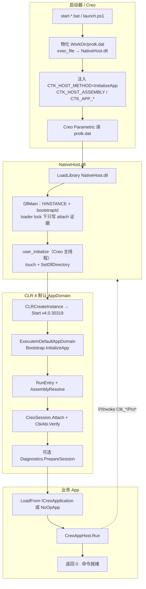
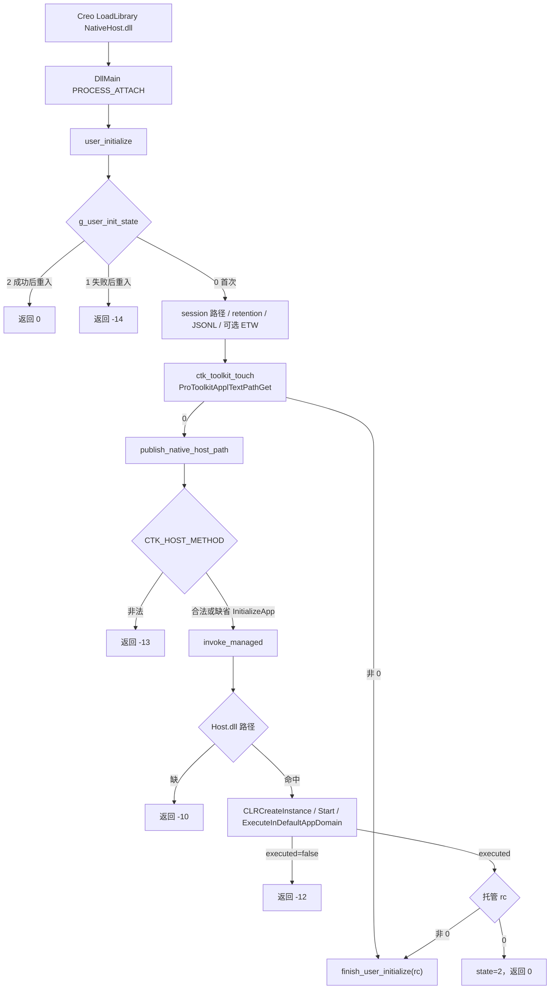
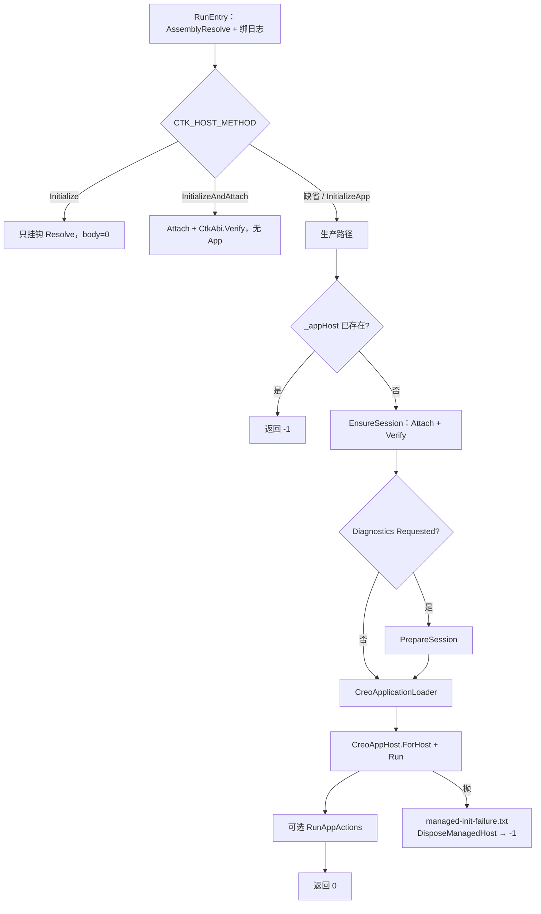
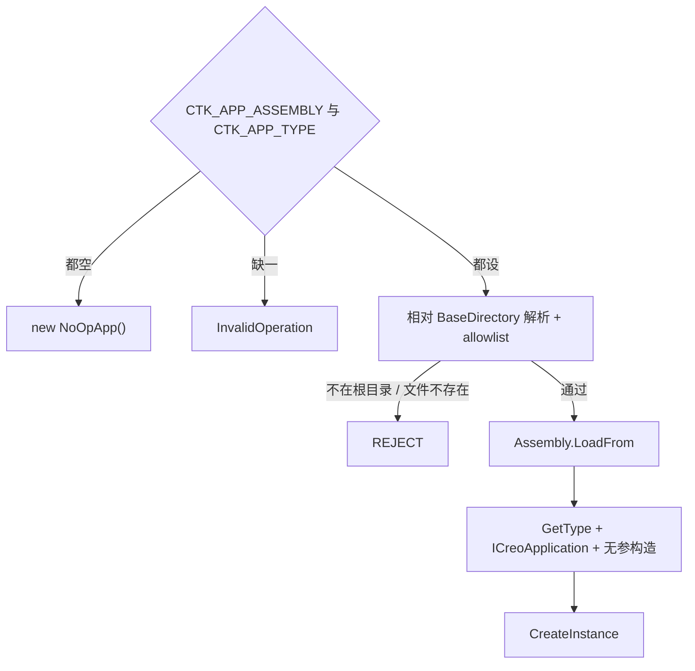
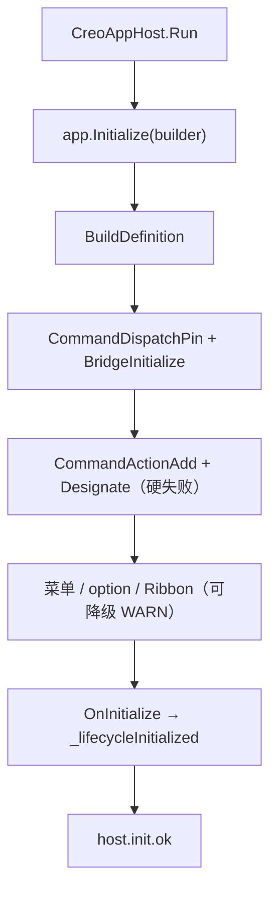
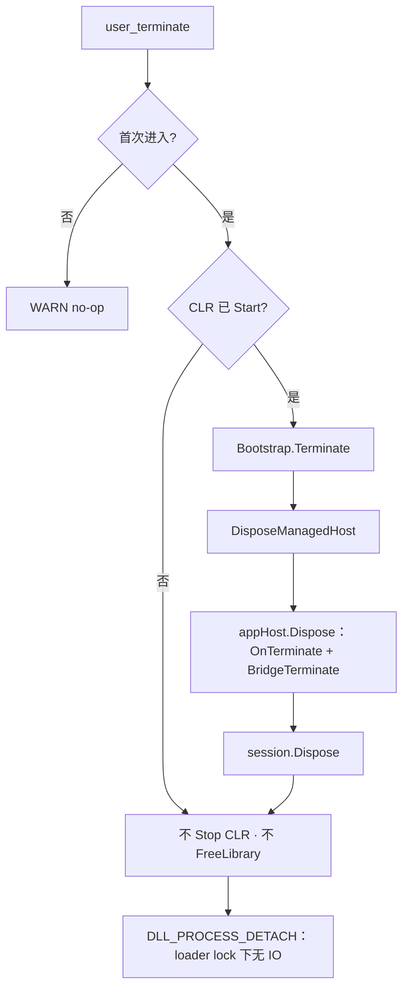

# 宿主加载流程图

可编辑原图：[host-loading.drawio](./host-loading.drawio)（diagrams.net 多页）。

契约正文仍以 [creo-host-loading.md](../creo-host-loading.md) 与源码为准；本页是对照视图。布局脚本：[_gen_host_loading.py](./_gen_host_loading.py)（在 diagrams.net 里手工改过图之后不要再跑脚本覆盖）。

## 怎么打开

| 方式 | 做法 |
|---|---|
| 浏览器 | 打开 [diagrams.net](https://app.diagrams.net/)，File → Open from → Device，选本文件 |
| VS Code | 安装 [Draw.io Integration](https://marketplace.visualstudio.com/items?itemName=hediet.vscode-drawio)，直接打开 `.drawio` |
| GitHub | 本页下方 mermaid 可渲染；`.drawio` 本身不在网页里预览 |

六页：

1. **总览 · 进程内加载链** — launcher → Creo → NativeHost → CLR 4 → Host → App
2. **Native · user_initialize** — DllMain 约束、重入守卫、返回码
3. **Managed · Bootstrap 入口** — 三方法 + `InitializeApp` 生产路径
4. **应用装配 · LoadFrom** — NoOpApp / allowlist / AssemblyResolve / SampleCatalog
5. **CreoAppHost.Run · 命令注册** — 硬失败命令 vs 可降级菜单
6. **停止 · user_terminate** — 处置对象，不卸 CLR / 不卸 DLL

---

## 1. 总览 · 进程内加载链

运行时真正触达 Creo 的 native DLL 只有 `CreoToolkit.NativeHost.dll`。不部署 `nethost` / `hostfxr` / `runtimeconfig.json`。

---

## 2. Native · user_initialize

DllMain 禁止堆、线程、`LoadLibrary`、递归 mkdir。Creo 对 `user_initialize` 非零通常不再调 `user_terminate`。

---

## 3. Managed · Bootstrap 入口

`Initialize` / `InitializeAndAttach` 没有 in-tree `start-*.bat`。`Terminate` 只由 `user_terminate` 调用，不在 `initialize_method` 白名单里。

---

## 4. 应用装配 · LoadFrom

`AssemblyResolve` 先复用已加载副本，再只探测 Host / Sdk / Interop / `CTK_HOST_ASSEMBLY` 所在目录。Sample 模块来自编译期 `samples/SampleCatalog.props`，不是运行时扫盘。

---

## 5. CreoAppHost.Run

命令回调：`0` 成功 / `1` handler 异常 / `2` 未注册。F5（`OnInitialize` 抛）不调 `OnTerminate`。

---

## 6. 停止 · user_terminate

同进程不承诺再 `LoadFrom` 另一个 app。要换 app 就重启 Creo。
